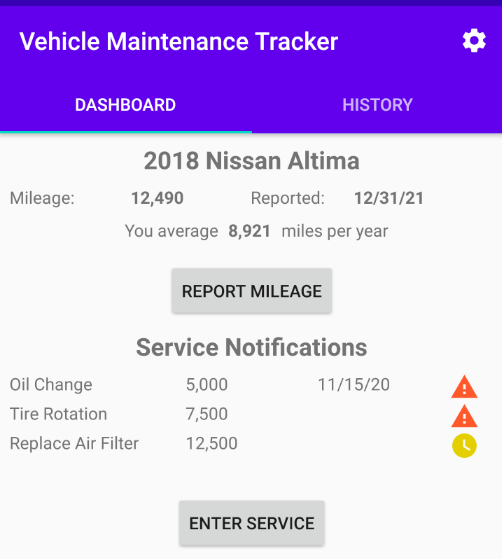
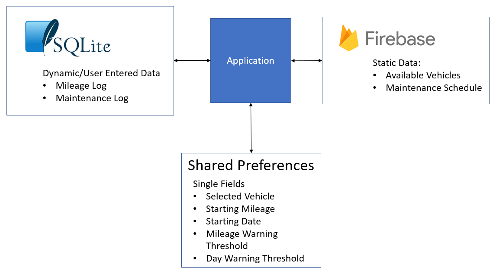

#  Vehicle Maintenance Tracker

## Description

Take the guesswork out of managing the maintenance of your vehicles.  No more missed oil changes or tire rotations.  This app will help you extend the longevity of your vehicle by helping to keep it properly maintained.  Just select your vehicle, and a tailored maintenance schedule will be used to inform you of upcoming or overdue maintenance items.

# 

## Data Flow

Firebase is used for accessing static data.  SQLite and shared preferences are used for user-entered data.

## Rubric Highlights

[x] App is written solely in the Java programming language

[x] Stable release versions of libraries, Gradle, and Android Studio are used

[x] App integrates a third party library.  I am leveraging the Timber logging framework in my app.  I was going to use Butterknife
but I noticed that has been deprecated in favor of using Android's new built-in View Binding library which is part of Jetpack.

[x] App validates server responses and user input.  I added validation to the appropriate fields in the various activities.
I have error handling if a service returns a failure response.

[x] All strings are kept in a strings.xml file instead of hardcoded.

[x] App provides a widget for relevant information on the home screen.  The widget I created will show a list of service
notifications and when clicked, will bring if the application dashboard activity.

[x] App integrates two or more Google services

[x] Each service imported in build.gradle is used in the app.

[x] App theme extends AppCompat

[x] App uses an app bar and associated toolbars.

[x] App uses transitions between activities.

[x] All app dependencies are managed by Gradle

[x] App stores data locally using Room or Firebase realtime database.  For my app, I am leveraging both services.
See the diagram included above for more info.

[x] No unecessary calls are made to the data store.  I am using LiveData to monitor changes to the SQLite tables.

## Fixes made to address V1.0 code review

* All strings are defined in strings.xml.
* Integrated second Google Play service - AdMob
* App includes signing configuration
* App builds using the installRelease Gradle task
* Implemented a WorkManager job to periodically fetch the MaintenanceSchedule data from Firebase